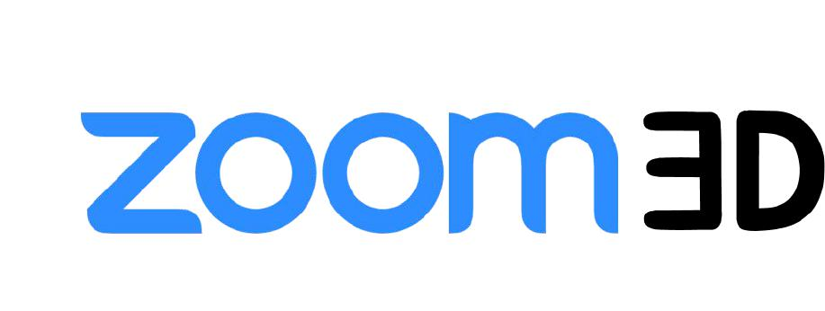
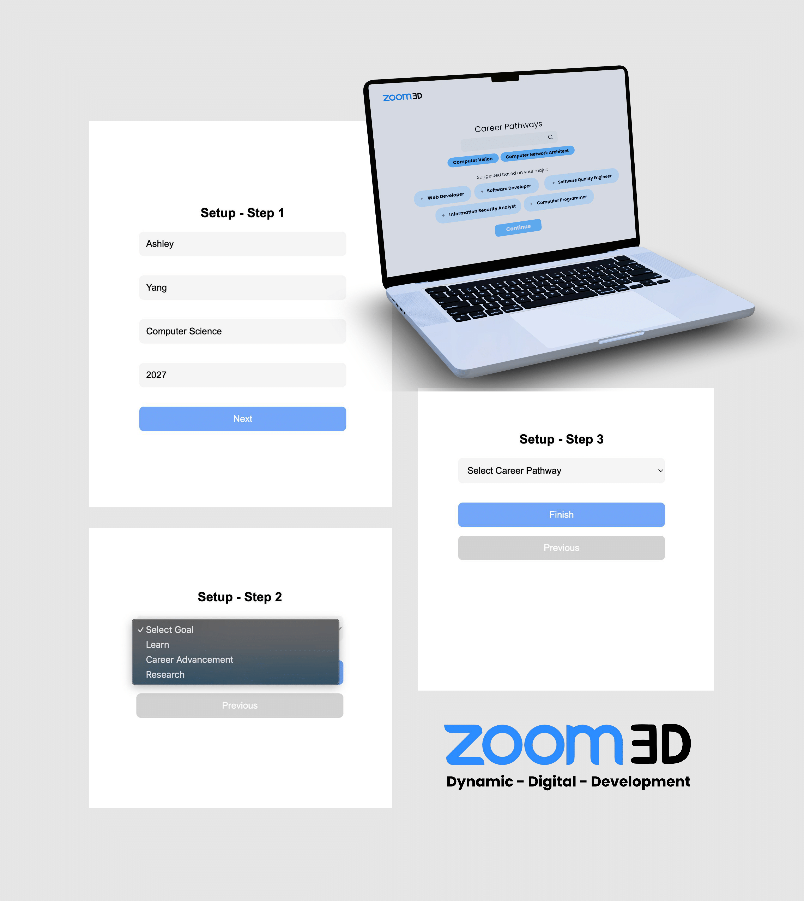

<div align="start">
  
</div>
## ZOOM3D (Zoom Education)

## Problem Statement
### Student Struggles
1. **🎯 Unclear Priorities**  
   - Many college students change their majors due to misaligned course selections
   - Miss key workshops/networking events (*Student Engagement* criterion)  

2. **📉 Fragmented Learning**  
   - Not sure how classes interrelate (*Graduation Barrier*)  
   - Zoom lectures remain untapped for insights (*Innovation*)  

3. **🤖 Scaling Limits**  
   - Manual advising can't personalize at scale (*Scalability*)


ZOOM3D analyzes class discussions (via Zoom transcripts) and student aspirations to generate:  
- 📊 **Interactive graphs** of past class connections  
- 🎯 **Tailored course recommendations**  
- 📅 **Relevant workshops/events** for skill growth  

## Our Solution  
**Transform Zoom transcripts and career goals into personalized academic roadmaps.**  
- **Smart Recommendations**: "Take CSE 360 for web dev goals" (*Career Pathways*)  
- **3D Knowledge Graph**: Visualize class connections (*Prototype Functionality*)  
- **Event Matching**: Auto-alerts for relevant hackathons/panels  
 
<div align="center">
  
</div>

## Key Features
- **Transcript Analysis**: Extracts key topics from Zoom recordings.
- **Goal Matching**: Aligns courses with career objectives (e.g., "Web Development" → CSE360 + software engineering panels).
- **Dynamic Graph**: Visualizes how past and current classes interrelate using a [force-directed graph](https://github.com/vasturiano/force-graph?tab=readme-ov-file).
- **Event Feed**: Recommends hackathons, career fairs, and workshops (e.g., "Attend the Google Tech Talk based on your interest in cloud computing").

## Installation
Clone the repo:
   ```bash
   git clone https://github.com/sunyentan/zoom-3d.git
npm install
npm run dev
npm src/server.js
